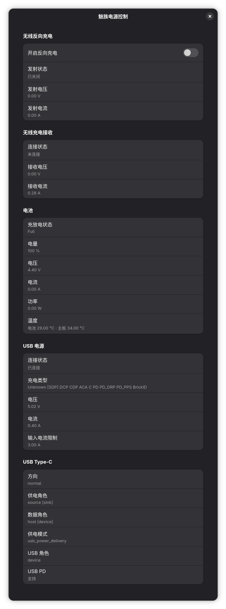
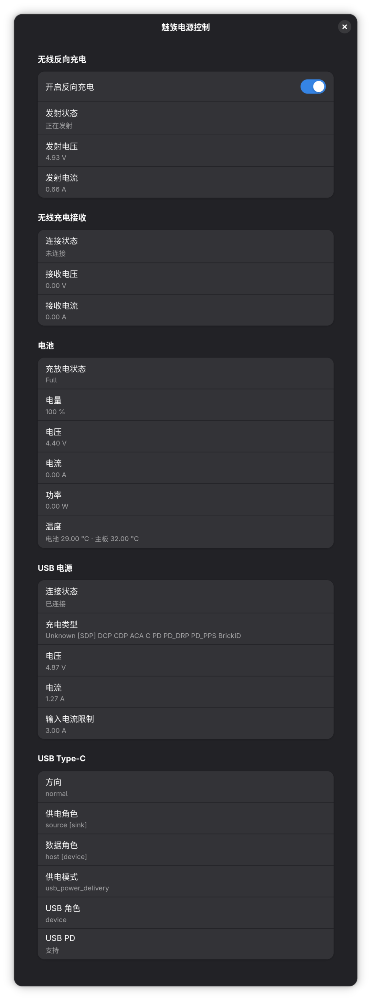
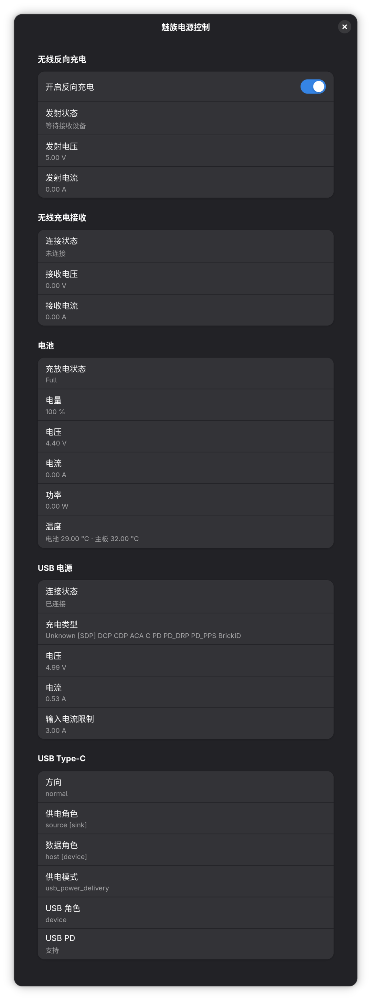

# Meizu Power Control

English | [简体中文](README.zh-CN.md)

A GTK 4/libadwaita power status utility for the Meizu 20 Infinity running
mainline Linux. It reads the standard power_supply and Type-C sysfs interfaces to
show:

- Wireless reverse charging switch, transmitter state, voltage and current
- Wireless charging receiver state
- Battery capacity, charge/discharge state, power and temperature
- USB power supply plus Type-C role, orientation and USB PD state

The reverse charging switch is toggled through a small polkit helper that only
allows writing `0` or `1` to
`/sys/class/power_supply/qcom-battmgr-wls-tx/online`, so the main UI never needs
to run as root.

The interface follows the system language. English and Simplified Chinese are
currently available.

## Screenshot

<p align="center">
  
  
  
</p>

## Build

On Arch Linux / Arch Linux ARM:

```sh
sudo pacman -S --needed base-devel meson ninja pkgconf gtk4 libadwaita
meson setup build --prefix=/usr
meson compile -C build
```

## Install

```sh
sudo meson install -C build
```

Then run `meizu-power-control`. polkit will ask for authentication the first time
you toggle wireless reverse charging.
